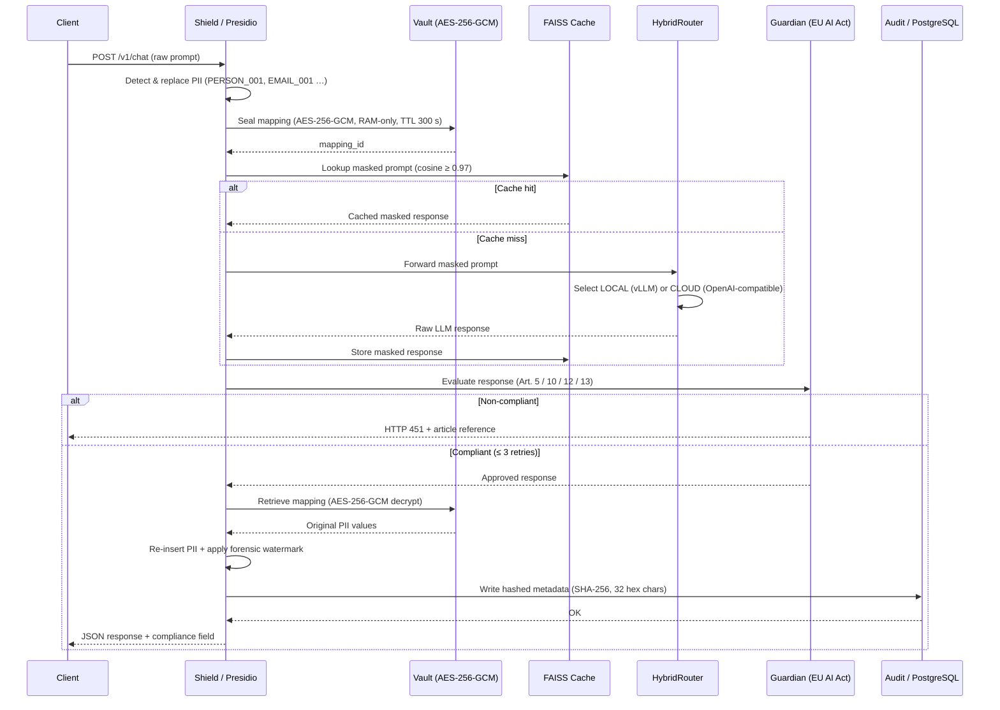

# shieldlayer-max

> On-premise FastAPI proxy enforcing EU AI Act compliance — anonymizing PII before every LLM call, auditing every response with an encrypted Zero-Persistence Vault, and watermarking outputs for forensic traceability. No plaintext leaves your server.

---

## Request Pipeline



---

## How It Works

1. **PII Anonymization** — Microsoft Presidio scans every inbound prompt and replaces names, e-mail addresses, IBANs, and other entities with deterministic placeholders (`PERSON_001`, `EMAIL_001`). The LLM never sees raw personal data.

2. **Zero-Persistence Vault** — The placeholder-to-PII mapping is encrypted with AES-256-GCM and held exclusively in RAM. Keys are zeroed via `ctypes.memset` after use. The Vault enforces a 300-second TTL; no mapping survives a process restart.

3. **Semantic Cache** — The masked prompt is embedded and compared against the FAISS index using cosine similarity. If a prior response scores 0.97 or higher, it is returned immediately — bypassing the LLM call entirely and reducing latency and cost.

4. **HybridRouter** — On a cache miss, the router selects either the LOCAL backend (vLLM, on-premise GPU) or the CLOUD backend (any OpenAI-compatible API) based on the `LLM_BACKEND_TYPE` setting. All traffic to the cloud backend is already anonymized at this point.

5. **Guardian Compliance Judge** — The raw LLM response is evaluated against EU AI Act Articles 5, 10, 12, and 13. If a violation is detected, the Guardian triggers a self-correction loop (up to `GUARDIAN_MAX_RETRIES` attempts). Responses that remain non-compliant after all retries are blocked and returned to the client as HTTP 451.

6. **De-anonymization** — Approved responses are passed back through the Vault: placeholders are replaced with the original PII values. The mapping is then zeroed from memory.

7. **Forensic Watermarking** — A deterministic synonym substitution (seeded by `request_id`) is applied to the response text. If a response is ever leaked, the watermark identifies the originating session without storing any plaintext.

8. **Audit Trail** — Only SHA-256 hashes (truncated to 32 hex chars) of the prompt and response, together with compliance metadata, are written to PostgreSQL. No plaintext prompt, no plaintext response, and no PII mapping is ever persisted to disk.

---

## Quick Start

### Prerequisites

| Requirement | Details |
|-------------|---------|
| Docker Desktop | [docker.com](https://www.docker.com/products/docker-desktop/) |
| Docker Compose | Included with Docker Desktop v2.0+ |
| LLM Backend | NVIDIA GPU + vLLM **or** CPU + Ollama |
| Disk space | ~4 GB (Ollama/Mistral) or ~16 GB (Llama-3-8B) |
| Python 3.11 | Only required for local development |

**GPU path only:** NVIDIA GPU with CUDA 12.1+ and [NVIDIA Container Toolkit](https://docs.nvidia.com/datacenter/cloud-native/container-toolkit/install-guide.html).

---

### Option A — GPU (vLLM, recommended for production)

```bash
git clone https://github.com/arthurweb1/shieldlayer-max.git
cd shieldlayer-max
git checkout feature/shieldlayer-implementation

cp .env.example .env
# Edit .env: set POSTGRES_PASSWORD, AUDIT_TOKEN, VLLM_MODEL

# Download model weights once (~16 GB)
pip install huggingface_hub[cli]
huggingface-cli download meta-llama/Meta-Llama-3-8B-Instruct

docker compose up -d
```

---

### Option B — CPU / Ollama (no NVIDIA GPU required)

**1. Install Ollama:** https://ollama.com/download

**2. Pull a model:**
```bash
ollama pull mistral
```

**3. Configure `.env`:**
```env
LLM_BACKEND_TYPE=local
VLLM_BASE_URL=http://host.docker.internal:11434
VLLM_MODEL=mistral
VLLM_GUARDIAN_MODEL=mistral
```

**4. Edit `docker-compose.yml`** — remove the `vllm` service block (Ollama runs natively on your machine).

**5. Start:**
```bash
docker compose up -d postgres app
```

> CPU inference is slower (30–120 seconds per response depending on hardware). GPU is recommended for production workloads.

---

### Test the proxy

**Linux / macOS / Git Bash:**
```bash
curl -X POST http://localhost:8080/v1/chat \
  -H "Content-Type: application/json" \
  -d '{"messages": [{"role": "user", "content": "Max Mustermann at max@example.com needs GDPR advice."}]}'
```

**Windows PowerShell:**
```powershell
Invoke-WebRequest -Method POST http://localhost:8080/v1/chat `
  -Headers @{"Content-Type"="application/json"} `
  -Body '{"messages": [{"role": "user", "content": "Max Mustermann at max@example.com needs GDPR advice."}]}'
```

**Expected response:**
```json
{
  "id": "...",
  "content": "Max Mustermann should consider...",
  "compliance": {"compliant": true, "article": null, "retries": 0},
  "cached": false
}
```

The values `Max Mustermann` and `max@example.com` were replaced with `PERSON_001` and `EMAIL_001` before the prompt reached the LLM.

---

## In-Memory-Only Policy

The Double-Blind PII mapping is the most sensitive artifact in the pipeline. shieldlayer-max applies the following controls:

- **AES-256-GCM encryption in RAM** — The mapping is never serialized to disk, swap, or any log file. It exists only as an encrypted object in the process heap.
- **Key zeroing** — After each use, the encryption key is overwritten with zeros via `ctypes.memset`. The key does not persist between the seal and unseal operations.
- **TTL: 300 seconds** — Each Vault entry is automatically purged after 300 seconds (`VAULT_SESSION_TTL_SECONDS`). A process restart clears all entries unconditionally.
- **No plaintext persistence** — No PII mapping, no raw prompt, and no LLM response is written to disk at any point. The PostgreSQL audit log stores only SHA-256 hashes (truncated to 32 hex chars).

This design ensures that even a full disk image of the host contains no recoverable PII.

---

## High Availability

shieldlayer-max is designed to be deployed as a stateless service:

- **Stateless proxy** — The FAISS semantic cache and the Zero-Persistence Vault are in-process memory only. No shared file system or distributed cache is required.
- **Horizontal scaling** — Multiple instances can run behind a load balancer. Use sticky sessions (IP hash or session cookie) to ensure that a Vault entry created in one instance is available for de-anonymization in the same instance. If sticky sessions are not available, cache misses on re-routed requests are acceptable — the proxy will re-query the LLM.
- **Durable state** — PostgreSQL is the only component with durable state. Use a managed PostgreSQL service (e.g., Amazon RDS, Google Cloud SQL, Azure Database for PostgreSQL) for production high availability and automated backups.
- **Vault lifecycle** — Vault TTL purge runs per-instance. Each Vault entry is scoped to a single request/response cycle; there is no cross-request state.

---

## Prometheus Monitoring

shieldlayer-max exposes a standard Prometheus metrics endpoint:

- **Endpoint:** `GET /metrics`
- **Client:** `prometheus_client` (Python), exposing default process and GC metrics plus application-level counters.
- **Integration:** Configure your Prometheus instance to scrape `http://<host>:8080/metrics`. Import the provided Grafana dashboard (if available) or build your own using the exposed metrics.

**Recommended alerts:**

| Condition | Signal | Suggested threshold |
|-----------|--------|---------------------|
| Audit write failures | 5xx spike on `/v1/chat` | > 1% of requests over 5 minutes |
| Compliance blocks | HTTP 451 spike | > 5 blocks per minute |
| LLM backend errors | 5xx from HybridRouter | Any sustained error rate |

---

## EU AI Act Compliance

shieldlayer-max directly addresses the following obligations:

- **Art. 5 — Prohibited Practices** — The Guardian judge detects and blocks responses that could constitute manipulation, exploitation of vulnerabilities, or subliminal techniques. Blocked requests return HTTP 451 with an article reference in the response body.

- **Art. 10 — Data Governance** — PII masking via Microsoft Presidio ensures data hygiene at the model boundary. The Double-Blind pseudonymization scheme guarantees that personally identifiable data never enters the LLM context.

- **Art. 12 — Record-Keeping** — Every request is logged to an append-only PostgreSQL audit table containing hashed prompts, compliance results, article references, and timestamps. Audit records are exportable as a signed PDF via `GET /audit/export`.

- **Art. 13 — Transparency** — Every response includes a `compliance` field in the JSON payload. The Guardian's per-request assessment is recorded in the audit log, enabling downstream transparency obligations.

---

## Forensic Watermarking

Every response contains a hidden linguistic watermark. A deterministic seed derived from the `request_id` (stored in the audit log) drives synonym substitutions in the response text (e.g., "however" becomes "nevertheless"). If a response is leaked, the watermark can be matched against the audit log to identify the originating session — without storing any plaintext.

---

## API Reference

| Method | Endpoint | Auth | Description |
|--------|----------|------|-------------|
| `POST` | `/v1/chat` | None | Submit a prompt through the full compliance pipeline |
| `GET` | `/audit/export` | `Bearer <AUDIT_TOKEN>` | Download the audit log as a PDF |
| `GET` | `/health` | None | Liveness check |
| `GET` | `/metrics` | None | Prometheus metrics scrape endpoint |

**HTTP status codes:**

| Code | Meaning |
|------|---------|
| `200` | Success |
| `451` | Response blocked — EU AI Act violation (article reference in body) |
| `500` | Audit write failure (compliance logging is mandatory per Art. 12) |

---

## Configuration (`.env`)

Copy `.env.example` to `.env` and set the required values before starting the stack.

**Required changes:**

| Variable | Description | Default |
|----------|-------------|---------|
| `POSTGRES_PASSWORD` | PostgreSQL password — **change before deploying** | `CHANGE_ME` |
| `AUDIT_TOKEN` | Bearer token for `/audit/export` — **change before deploying** | `change-me-to-a-secure-token` |
| `VLLM_MODEL` | Model name (must match downloaded weights) | `meta-llama/Meta-Llama-3-8B-Instruct` |
| `VLLM_BASE_URL` | LLM server base URL | `http://vllm:8000` |

<details>
<summary>Full environment variable reference</summary>

| Variable | Description | Default |
|----------|-------------|---------|
| `LLM_BACKEND_TYPE` | `local` (vLLM) or `cloud` (OpenAI-compatible) | `local` |
| `OPENAI_API_KEY` | API key for cloud backend (only used when `LLM_BACKEND_TYPE=cloud`) | *(unset)* |
| `OPENAI_BASE_URL` | Base URL for cloud backend (e.g., `https://api.openai.com/v1`) | *(unset)* |
| `VLLM_BASE_URL` | LLM server URL for local backend | `http://vllm:8000` |
| `VLLM_MODEL` | Model for main inference | `meta-llama/Meta-Llama-3-8B-Instruct` |
| `VLLM_GUARDIAN_MODEL` | Model for compliance checking (can be same model) | `meta-llama/Meta-Llama-3-8B-Instruct` |
| `VAULT_SESSION_TTL_SECONDS` | Lifetime of each Vault entry in RAM | `300` |
| `GUARDIAN_MAX_RETRIES` | Self-correction attempts before blocking | `3` |
| `CACHE_SIMILARITY_THRESHOLD` | Cosine similarity threshold for cache hits | `0.97` |
| `AUDIT_TOKEN` | Bearer token for `/audit/export` | *(set a strong value)* |
| `SHIELD_SYNONYM_PAIRS_PATH` | Path to watermark synonym pairs file | `/app/data/synonym_pairs.json` |
| `POSTGRES_DSN` | Full PostgreSQL DSN (auto-built from component vars if unset) | *(auto)* |
| `POSTGRES_USER` | Database username | `shieldlayer` |
| `POSTGRES_PASSWORD` | Database password | `CHANGE_ME` |
| `POSTGRES_DB` | Database name | `shieldlayer` |
| `HF_HOME` | Hugging Face model cache directory | `~/.cache/huggingface` |

</details>

---

## License

MIT License — see [LICENSE](LICENSE) for details.
